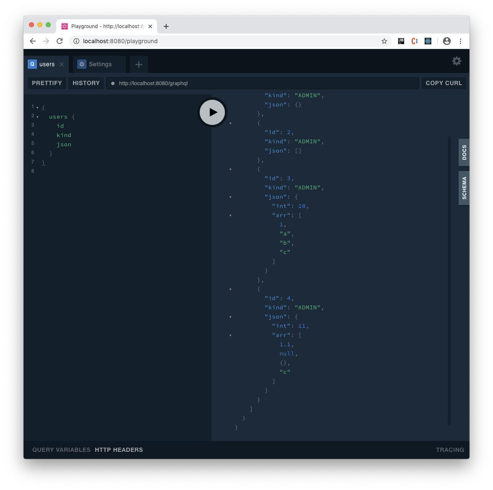

# Rust GraphQL JSON Example


- Juniper GraphQL Server
- Warp
- Rust
- `serde_json::Value`

## Installation and run

It is as easy as (just wait a bit running this from the clean state)
```
cargo run
```
visit http://localhost:8080/playground and type there something like
```
{ users { id kind json } }
```
expected result
